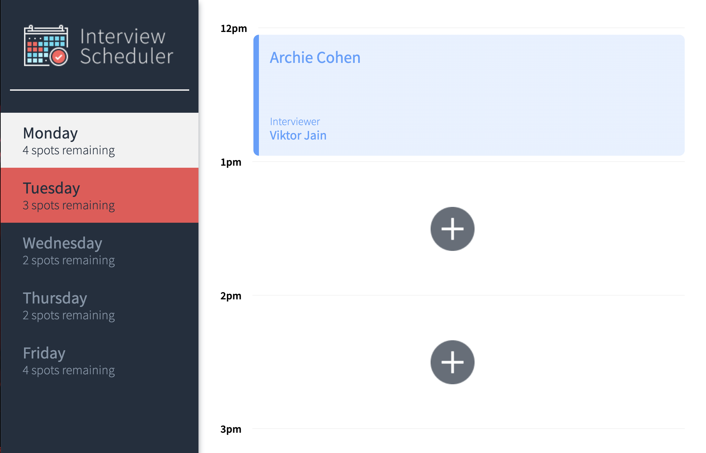
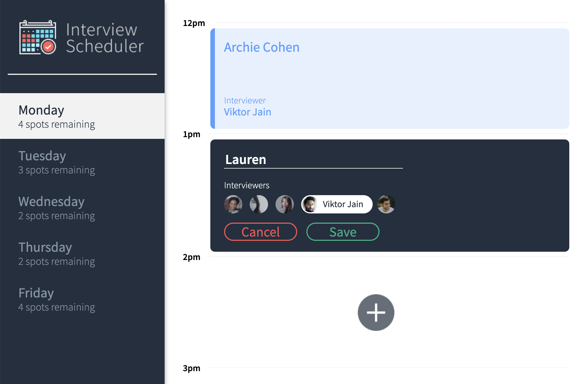

# Interview Scheduler
Interview Scheduler is a full stack web application built with React that allows users to book, edit and cancel appointments with a selected interviewer.

## Final Product




## Dependencies

- React
- Axios
- Classnames
- @testing-library

## Setup

Install dependencies with `npm install`.

## Running Webpack Development Server

```sh
npm start
```

## Running Jest Test Framework

```sh
npm test
```

## Running Storybook Visual Testbed

```sh
npm run storybook
```
